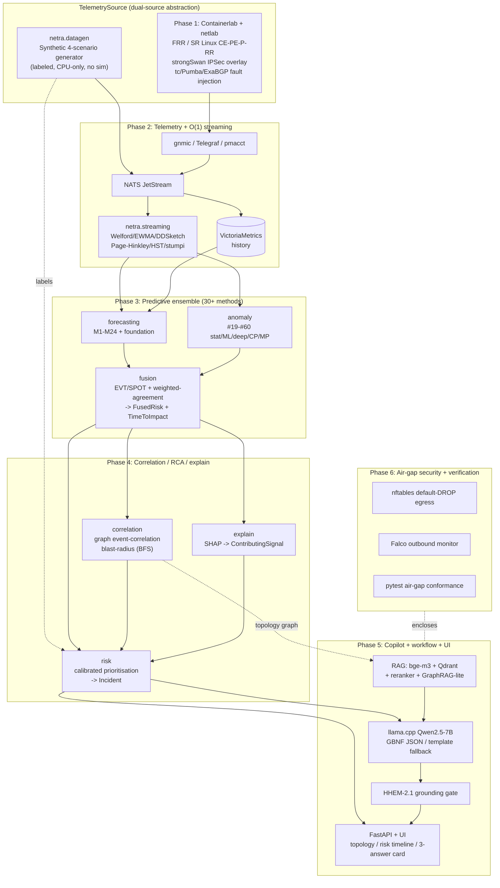

# NETRA — Master Architecture

**NETRA** · *Network Early-warning, Telemetry & Reasoning Assistant*
*("netra" — नेत्र — also means "eye" in Sanskrit: apt for foresight and visibility.)*

**Problem Statement 13 — Air-Gapped Predictive Copilot for Secure MPLS Operations**
Status: **Definitive architecture (locked).** This document is the contract the whole build team implements against. Companion deliverables: shared contracts in [`netra/contracts/`](netra/contracts), dependency manifests ([`requirements.txt`](requirements.txt), [`requirements-core.txt`](requirements-core.txt)), and the workstream split in [`docs/BUILD_PLAN.md`](docs/BUILD_PLAN.md).

---

## 1. Executive summary

Conventional NOC tooling is **reactive**: threshold alerts fire only *after* a service has already degraded, and regulated/air-gapped environments forbid the cloud AI that would otherwise help. NETRA closes both gaps. It is a fully **offline, air-gapped predictive copilot** that watches a simulated SD-WAN-over-MPLS network, forecasts degradation with enough **lead time** to intervene, explains *why* in grounded natural language, and recommends *what to do* — all with **verifiably zero outbound network dependency**.

NETRA answers the three operational questions in real time:

- **Q1 — What is likely to fail next, and when?** A 30+ method predictive ensemble forecasts each metric's trajectory and computes a calibrated **time-to-impact** (lead time to SLA/security breach).
- **Q2 — Why is risk elevated, which signals contributed?** SHAP attributions + graph event-correlation + RCA produce a ranked, grounded set of **contributing signals** and a root-cause hypothesis.
- **Q3 — What corrective action should be taken?** The copilot retrieves the matching **playbook** from local runbooks and proposes ordered, approval-gated, rollback-capable actions.

**The defining engineering decision** is that NETRA runs **end-to-end on a plain CPU box with no internet and no GPU**. This is achieved by a **dual-source telemetry abstraction** (the same `TelemetrySource` interface is satisfied by either the live Containerlab sim *or* a high-fidelity synthetic scenario generator that replays the four validation scenarios with ground-truth labels) and by **graceful degradation** of every heavy/optional component (if the 7B LLM is absent, a deterministic template copilot emits the *same* structured response so the pipeline still runs and is testable). The full stack — sim, GPU deep models, the quantized LLM, the RAG vector DB — upgrades quality but is never required to *run*, *demo*, or *pass the air-gap conformance test*.

**Locked default stack:**

| Phase | Locked choice |
|---|---|
| 1 — Simulation | Containerlab + netlab + FRRouting (+ Nokia SR Linux telemetry nodes) + strongSwan IPSec overlay; iperf3/TRex/Scapy traffic; tc/netem + Pumba + ExaBGP/GoBGP fault injection |
| 2 — Telemetry | gnmic + Telegraf (+ pmacct) → NATS JetStream → River/stumpy/ddsketch O(1) online features → VictoriaMetrics history |
| 3 — Predictive | Multi-method ensemble (forecasting M1–M24 + anomaly/change-point/graph #19–#68 = 50+ methods) fused via score-normalisation + weighted-agreement + EVT/SPOT thresholding; SHAP for explanations |
| 4 — Correlation/RCA | NetworkX digital-twin graph: event correlation + RCA + blast-radius (BFS) + calibrated (Platt) risk scoring |
| 5 — Copilot | Qwen2.5-7B-Instruct on llama.cpp `llama-server` (GBNF-constrained JSON) + bge-m3 / Qdrant / bge-reranker-v2-m3 hybrid RAG + GraphRAG-lite over topology + HHEM-2.1 offline grounding; FastAPI + lightweight UI (Grafana for dashboards) |
| 6 — Air-gap | nftables default-DROP egress + Falco outbound monitor + pytest air-gap conformance test; offline bundling via `docker save` + pinned wheels + SBOM |

---

## 2. Component & data-flow diagram (all 6 phases)



**Data contracts on the wire (every arrow above carries a `netra.contracts` type):** `TelemetryRecord` / `SyslogEvent` / `RoutingEvent` / `FlowRecord` / `TunnelStat` from the source → `FeatureVector` out of streaming → `Forecast` + `AnomalyScore` from the ensemble → `FusedRisk` + `TimeToImpact` from fusion → `Incident` (with `BlastRadius`, `ContributingSignal[]`, `Playbook`) from correlation/risk → `CopilotRequest` / `CopilotResponse` at the copilot boundary. Ground truth flows as `ScenarioLabel`.

---

## 3. Per-phase design

### Phase 1 — Simulated SD-WAN/MPLS environment

A reproducible, fully offline, multi-site topology built as **topology-as-code**.

- **Platform:** **Containerlab** (declarative `*.clab.yml`, container-native, 200+ nodes/host, sub-second teardown — ideal for repeating the four scenarios and regenerating datasets). **netlab 26.06** generates the Containerlab file *and* per-device configs from one YAML, then `netlab create` freezes a self-contained Containerlab bundle that runs without netlab installed (the air-gap artifact). Fallback: GNS3 only if a VM-only NOS is ever required (bridged via vrnetlab).
- **NOS:** **FRRouting 10.x** everywhere (free, OSPF/IS-IS/LDP/SR-MPLS/MP-BGP VPNv4/VRF) with **2 PE + 1–2 P** nodes swapped to **Nokia SR Linux** for native gNMI/OpenConfig streaming telemetry. Real MPLS forwarding uses the host kernel MPLS modules (`mpls_router`).
- **Reference topology:** 5 sites, ~18–22 nodes — **DC** (dual PE + RR candidate), **HQ/Hub** (hub-spoke aggregation, scenario A target), **Branch-1/2/3** (spokes), **MPLS core** (3–4 P routers, IS-IS + SR-MPLS, scenario C target), **Route Reflector** (VPNv4, scenario B target). Underlay = IS-IS + SR-MPLS (LDP variant as a second profile). L3VPN = VRFs `CORP` + `OT` (RD/RT `100:1` / `100:2`); `send-community both` enforced on the VPNv4 session. Overlay = strongSwan GRE-over-IPSec, hub-spoke + partial mesh, with BGP/OSPF inside the tunnels. QoS via `tc` HTB classes (voice/business/bulk).
- **Traffic:** iperf3 baselines + diurnal ramps, TRex ASTF for realistic stateful app mix and latency/jitter, Scapy for adversarial flows — all seeded for byte-level reproducibility.
- **Fault injection (labeled):** `tc`/`netem` + **Pumba** (container-targeted chaos), **ExaBGP/GoBGP** (route flap), link up/down, and config pushes (drift). For *every* fault the orchestrator writes a `ScenarioLabel` JSONL **before** injection starts (and closes it on cleanup), guaranteeing the window exactly bounds the impairment.

> **Critical:** Phase 1 is *optional* for the demo. The same labeled telemetry is produced by `netra.datagen` (below). Phase 1 is the "real" source that proves fidelity; the synthetic source guarantees the system is always runnable.

### Phase 2 — Telemetry pipeline + O(1) streaming features

Collect, normalise, bus, persist, and — most importantly — **score in O(1) per sample** so precursors are detected with minimum latency (lead time you don't burn waiting for a batch boundary is lead time the NOC gets).

- **Collectors:** **gnmic** (gNMI `on-change` + `sample(1s)` — sub-second deltas the instant a counter flips) + **Telegraf** (SNMP, syslog, NetFlow/IPFIX, sFlow — covers all five PS signal classes in one config; `remote_write` to VictoriaMetrics). Add **pmacct/nfacctd** if flow volume is heavy. Every collector is a single static Go/C binary, no cloud deps.
- **Bus:** **NATS JetStream** (one ~10–15 MB binary, persistent streams, durable consumers, replay, exactly-once for the alert stream). Subjects: `telemetry.>` (at-least-once, idempotent), `alerts.>` (work-queue, exactly-once).
- **Online feature engine (`netra.streaming`):** consumes the bus and folds each sample into constant-memory running stats, emitting a `FeatureVector` per entity per tick:
  - **Welford / EWMA / Rolling** (`river.stats`) — level & slope, O(1).
  - **Page-Hinkley / ADWIN / KSWIN** (`river.drift`) — drift/change-point triggers, the precursor firing signal.
  - **DDSketch** (`ddsketch`) — p95/p99 latency & jitter tails with relative-error guarantee, mergeable across devices.
  - **Half-Space-Trees** (`river.anomaly`) — always-on unsupervised multivariate anomaly, O(1).
  - **stumpy.stumpi** — incremental Matrix Profile discord (shape anomaly), O(1)-amortised.
  - **SNARIMAX / Holt-Winters / Kalman** (`river.time_series` / `statsmodels`) — online forward projection; the trajectory's threshold-crossing time *is* the streaming time-to-impact.
- **History:** **VictoriaMetrics single-node** (+ `vmagent` on-disk buffering) — best ingest/query per CPU at high cardinality, ~70× less disk than alternatives, PromQL/MetricsQL; feeds Grafana and the Phase-3 batch trainers.

### Phase 3 — Predictive ensemble (30+ methods)

No single detector covers all four fault morphologies (slow drift / bursty churn / intermittent spikes / step regime change). NETRA runs a **tiered, heterogeneous ensemble** so methods cross-verify and fill each other's gaps, then fuses them with **EVT/SPOT** adaptive (not hand-set) thresholds and **weighted agreement across independent families** as the calibrated confidence signal. The catalogue spans **50+ methods**; the **deployed subset** is curated for CPU-first operation (deep/foundation members are feature-flagged on).

The method families (deployed members in **bold**):

| Family | Methods (research #) | Deployed subset |
|---|---|---|
| **A. Classical statistical forecast** | M1 ARIMA/SARIMAX · M2 AutoARIMA · M3 ETS/Holt-Winters · M4 Theta · M5 (T)BATS · M6 Croston/SBA/TSB | **M2 AutoARIMA, M3 AutoETS, M4 Theta, M6 Croston** (`statsforecast`) |
| **B. Multivariate / state-space** | M7 VAR/VARMAX · M8 Kalman/structural · M9 Dynamic Factor | **M8 Kalman** (`statsmodels`, O(1) online), M7 VAR |
| **C. Decomposition** | M10 STL · M11 MSTL · M12 Prophet · M13 NeuralProphet | **M11 MSTL** (`statsforecast`), M12 Prophet (interpretable changepoints) |
| **D. Gradient-boosted global** ⭐ | M14 LightGBM · M15 XGBoost · M16 CatBoost | **M14 LightGBM global** (`mlforecast`) — primary accuracy driver; M15 XGBoost-quantile |
| **E. Deep learning** | M17 LSTM/GRU · M18 TCN/BiTCN · M19 DeepAR · M20 N-BEATS/N-HiTS · M21 TFT/PatchTST · M22 DLinear/NLinear/TSMixer/TiDE | *optional-heavy:* **M22 DLinear/NLinear, M20 N-HiTS, M19 DeepAR** (`neuralforecast`) |
| **F. Probabilistic / quantile** ⭐ | M23 Quantile regression + Conformal (split/CQR/EnbPI/ACI) | **M23 MAPIE conformal** over the ensemble — calibrated lead-time bands |
| **G. Survival / time-to-event** ⭐ | M24 Cox PH · RSF · GBSA · AFT + threshold-crossing extrapolation | **M24 Cox PH / RSF** (`scikit-survival`/`lifelines`) — direct lead time |
| **Foundation (zero-shot)** | Chronos / Chronos-Bolt · TimesFM · Moirai · Lag-Llama | *optional-heavy:* **Chronos-Bolt-base** (CPU, local weights) for cold-start |
| **1. Statistical / streaming AD** | #19 robust-z · #20 EWMA · #21 Shewhart · #22 ESD · #23 S-H-ESD · #24 HBOS · #25 COPOD/ECOD · #26 HST · #27 RRCF · #28 Mahalanobis-MCD · #29 KNN/LOF/CBLOF | **#19, #20, #25 COPOD+ECOD, #26 HST, #28 Mahalanobis** (`river`, `pyod`) |
| **2. ML unsupervised** | #30 Isolation Forest · #31 EIF · #32 OCSVM · #33 PCA/RPCA · #34 DBSCAN/HDBSCAN · #35 GMM · #36 spectral | **#30 Isolation Forest (+TreeSHAP), #33 PCA-recon** (`sklearn`/`pyod`) |
| **3. Deep AD** | #50 AE · #51 VAE · #52 LSTM-AE · #53 USAD · #54 TranAD · #55 Anomaly Transformer · #56 OmniAnomaly · #57 DeepSVDD · #58 GANomaly · #59 Spectral Residual | *optional-heavy:* **#54 TranAD, #53 USAD, #52 LSTM-AE** (`deepod`); **#59 Spectral Residual** (CPU) |
| **4. Change-point / drift** | #37 CUSUM · #38 Page-Hinkley · #39 ADWIN · #40 KSWIN · #41 DDM/HDDM · #42 BOCPD · #43 PELT/BinSeg/KernelCPD | **#38 Page-Hinkley, #39 ADWIN, #42 BOCPD, #43 PELT** (`river`, `ruptures`) |
| **5. Matrix-profile** | #44 STUMPY stump/stumpi/mpdist | **#44 stumpi** (streaming discord) |
| **6. Graph / topology** | #45 PyGOD DOMINANT/AnomalyDAE · #46 MTAD-GAT/GDN · #47 centrality/community shift · #48 graph event-correlation · #49 causal/Granger | **#47, #48 (`networkx`), #49 Granger** (`statsmodels`); *optional-heavy:* #45 DOMINANT, #46 MTAD-GAT (`pygod`) |
| **7. Routing-instability** | #61 BGP churn/MRAI · #62 route-flap damping score · #63 AS-path/asymmetry · #64 OSPF LSA/adjacency | **#61–#64** (feature recipes → fed into the generic detectors) |
| **8. Fusion** | #67 score-normalisation + weighted-agreement + stacking | **#67** (`pyod.combination` + logistic stacker) → `FusedRisk` |
| **EVT thresholding** | #68 POT / SPOT / DSPOT (Generalized Pareto tail) | **#68 DSPOT** on residual & ensemble-score streams |
| **Explain + time-to-impact** | #65 SHAP/DIFFI · #66 trend-crossing + Cox survival | **#65 SHAP, #66** → `ContributingSignal` + `TimeToImpact` |

**Counting:** 24 forecasting + 37 non-forecasting (#19–#68 with sub-entries) = **55+ distinct methods**, far exceeding the 30-method robustness target. Robustness comes from *independent families agreeing*, not from any single model.

### Phase 4 — Correlation / RCA / risk / explain

Turns raw, per-entity scores into **one ranked, operator-ready `Incident`**.

- **Digital twin:** a `networkx.DiGraph` of CE/PE/P/RR + tunnels + sites, built from the Phase-1 topology (or the synthetic topology) and live routing tables. This is the authoritative graph — NETRA does **not** pay GraphRAG's LLM-ETL tax to rebuild a graph it already owns.
- **Correlation (two axes):** temporal sliding window (adaptive width to hit a target event density) + topological grouping via Weakly/Strongly-Connected-Components over the failure subgraph, so independent incidents don't merge and N symptoms collapse into 1 (report the **alarm compression ratio**).
- **RCA ranking:** within each group pick the node maximising `centrality × earliest_onset × causal_score`, where `causal_score` comes from pairwise **Granger causality** (temporal-aware, defensible) — emitted as `Incident.root_cause_entity` + `root_cause_hypothesis`.
- **Blast radius (deterministic):** `nx.descendants` / `single_source_shortest_path_length` from the root, intersected with NetFlow, → `BlastRadius` (affected sites/VPNs/SLAs/flow count + hop distances as a propagation proxy). Never an LLM guess.
- **Risk prioritisation:** product-form `Risk = AnomalyConfidence × TimeToImpactUrgency × BlastRadius × AssetCriticality` (product so a zero factor correctly suppresses false urgency), **Platt-scaled** to honest probabilities (report reliability diagram + Brier/ECE), with **BGP-style flap penalty/decay** suppression. Output: a ranked triage queue bucketed into P1/P2/P3.
- **Explain (Q2):** **TreeSHAP** over the tree detectors (exact, fast) + per-dimension ECOD/COPOD contributions + violated-PCA loadings → `ContributingSignal[]`, each pairing a signed attribution with a one-line human explanation.

### Phase 5 — Copilot, workflow & UI

- **LLM:** **Qwen2.5-7B-Instruct** (Apache-2.0, 128K ctx) on **llama.cpp `llama-server`** — no telemetry, no auto-updater (nothing to disable), OpenAI-compatible API, native **GBNF / JSON-schema constrained decoding**. Quant: **Q4_K_M** on CPU, **Q5_K_M** on GPU. CPU-only fallback model: Qwen2.5-3B or Phi-3.5-mini.
- **Structured output (guaranteed):** the `CopilotResponse` schema (see [`netra/contracts/copilot.py`](netra/contracts/copilot.py)) is compiled to a GBNF grammar so the model **cannot** emit malformed JSON or an out-of-vocabulary `predicted_issue`; a Pydantic validation + one constrained retry is the belt-and-suspenders client check.
- **RAG (grounding — the 35% lever):** `ingest → structure-aware chunk → local-LLM contextual prefix → bge-m3 (dense + learned-sparse) → Qdrant HNSW + sparse → hybrid retrieve top-150 → RRF → bge-reranker-v2-m3 → top-5..20 → grounded generation with enforced citations`. Mirrors Anthropic's Contextual-Retrieval + hybrid + reranking recipe (67% fewer retrieval failures), entirely offline.
- **GraphRAG-lite:** the Phase-4 topology graph answers *what/where/how-bad* (blast radius, affected scope) deterministically; text RAG answers *why/what-to-do* (root cause, remediation). Both are fused into the grounded prompt.
- **Anti-hallucination:** "answer only from context" contract + mandatory chunk-ID citations (closed-set rejected if not in context) + **abstain** (`insufficient_context: true`) + low temperature + confidence sourced from the analytics engine (not the LLM) + an offline **HHEM-2.1-Open** (DeBERTa-v3 NLI, <600 MB, CPU) faithfulness gate that retries-then-abstains below threshold.
- **Workflow:** playbooks as CACAO-style JSON in the RAG corpus; **suggest → operator-approve → execute** via Nornir/Netmiko/NAPALM; only read-only diagnostics auto-approve; every state-changing step has verify + rollback and is audit-logged.
- **UI:** **Grafana** (provisioned-as-code, all plugins/assets vendored) for the telemetry/alert wall + a custom **FastAPI + lightweight frontend** copilot page embedding a **Cytoscape.js** topology (root-cause node + blast-radius shaded), a **risk timeline** (the visual proof of "risk rising *before* impact"), the **3-answer incident card**, and a **chat box** streaming from the local model. All JS/CSS/fonts local — no CDNs.

### Phase 6 — Air-gap security & verification

Defense-in-depth so the system **literally cannot** reach the internet at runtime, plus runnable proof. See §8.

---

## 4. How NETRA answers Q1 / Q2 / Q3 (with confidence throughout)

| Question | Mechanism | Contract fields |
|---|---|---|
| **Q1 — what fails next & when** | Forecast trajectory (LightGBM/ETS/Kalman/…) + conformal band → first threshold crossing of the upper band = lead time; cross-checked by a Cox/RSF survival hazard. Computed online (O(1)) and refreshed every sample. | `Forecast`, `TimeToImpact.eta_seconds` (+ CI + `confidence`), `FusedRisk.predicted_issue`, `CopilotResponse.predicted_issue` / `time_to_impact_minutes` / `affected_scope` |
| **Q2 — why / which signals** | TreeSHAP over the firing tree detectors + ECOD per-dimension tails + graph event-correlation + Granger RCA → ranked signals, each with a signed attribution and a grounded one-liner. | `ContributingSignal[]` (`shap_value`, `direction`, `human_explanation`), `Incident.root_cause_hypothesis`, `CopilotResponse.contributing_signals` |
| **Q3 — what action** | Predicted issue → matching `Playbook` retrieved from local runbooks; ordered approval-gated steps with rollback; copilot cites the runbook chunk. | `Playbook` / `RecommendedAction` (`requires_approval`, `rollback`, `runbook_ref`), `CopilotResponse.recommended_actions` |

**Confidence is threaded end-to-end and is honest by construction:** detector `normalized_score` → `FusedRisk.calibrated_confidence` (Platt/isotonic, reliability-diagram validated) + `agreement` (fraction of independent families firing) → `TimeToImpact.confidence` → `CopilotResponse.confidence_score`. The LLM *explains* the analytics confidence; it never fabricates one. Cross-model **disagreement widens the lead-time band and lowers confidence**, prompting "needs human review" rather than a false certainty.

---

## 5. Dual-source telemetry abstraction & graceful degradation

This is the design principle that makes NETRA always-runnable, always-testable, and CPU-only-friendly.

### 5.1 One interface, two (three) sources

Everything downstream of ingest depends only on the `netra.contracts` telemetry types, never on *how* they were produced. A single `TelemetrySource` interface (implemented in `netra.datagen` and by the sim collector adapter) yields the identical `TelemetryRecord` / `SyslogEvent` / `RoutingEvent` / `FlowRecord` / `TunnelStat` stream from any of:

| `TelemetrySourceKind` | Backend | When used |
|---|---|---|
| `SIM` | Live Containerlab/netlab lab via gnmic/Telegraf/pmacct | High-fidelity demo on a capable host; proves real protocol behavior |
| `SYNTHETIC` | `netra.datagen` — high-fidelity generator that replays the 4 scenarios with **ground-truth `ScenarioLabel`s** | **Default for CPU-only demo/eval/CI**; no sim, no Docker, no GPU, no internet |
| `REPLAY` | Re-emits a previously captured/exported run | Deterministic regression testing; reproducing a specific incident |

Because the synthetic generator emits labeled streams, it doubles as the **training/eval ground truth** for Phase 3 and the **scenario driver** for Phase 6 — the same four scenarios the sim injects, with byte-level reproducible seeds.

### 5.2 Graceful degradation of heavy/optional components

| Component | If present | If absent (degraded path) | Pipeline still runs? |
|---|---|---|---|
| Containerlab sim | Live telemetry (`SIM`) | Synthetic source (`SYNTHETIC`) with labels | ✅ |
| GPU + deep models (TranAD/MTAD-GAT/DeepAR/foundation) | Added as ensemble members for accuracy | Skipped; CPU statistical + GBDT + change-point + graph ensemble carries the load | ✅ (fusion adapts weights) |
| Quantized 7B LLM / `llama-server` | Natural-language grounded copilot | **Deterministic template fallback** fills the *same* `CopilotResponse` schema from the analytics/incident objects (`used_fallback=True`, `model_id="template-fallback"`) | ✅ (and still schema-valid + testable) |
| Qdrant + embeddings (RAG) | Hybrid retrieval + citations from corpus | Direct structured-context grounding from `Incident` + a small in-process keyword match over the bundled corpus | ✅ |
| HHEM grounding model | Faithfulness gate scores every answer | Citation closed-set check + abstain-on-low-evidence still enforce grounding | ✅ |

The contract that makes this work: **the template fallback and the LLM both produce `CopilotResponse`**, so the API, UI and tests are identical whether or not a model is loaded. Every optional dependency is gated behind a feature flag and import-guarded; importing `netra.contracts` pulls in *only* pydantic (verified).

---

## 6. Validation scenarios → detectors → lead time → playbook

For each of the four required scenarios: the precursor signature, **which detectors fire**, the expected lead time, and the remediation playbook (suggest → approve → execute, every step verify + rollback). These map directly to `ScenarioId` and `IssueType` in the contracts.

| Scenario (`ScenarioId`) | Precursor signature | Detectors that fire | Predicted `IssueType` | Expected lead time | Playbook (Q3) |
|---|---|---|---|---|---|
| **A — Progressive congestion** (`A_congestion`) | Monotonic ↑ interface utilisation slope, queue-drop creep, latency/jitter drift before loss | Forecast-residual (#60), EWMA/CUSUM/Page-Hinkley (#20/#37/#38), Mann-Kendall trend, Matrix-Profile (#44), DSPOT (#68); LightGBM/MSTL/Kalman forecast → crossing; Cox survival (#66) | `interface_congestion` | **~2–10 min** (drift detectors fire while still below threshold) | Collect interface/queue stats (auto) → identify top-talker flows (NetFlow) → **propose** raise QoS for business class / shift to alternate SD-WAN path / rate-limit bulk → on approval push via NAPALM → verify utilisation drops, else rollback |
| **B — BGP route-flap cascade** (`B_bgp_flap`) | Bursty BGP UPDATE/withdraw churn, adjacency flaps, best-path A→B→A, OSPF SPF storms | Route-flap penalty + churn (#61/#62) → CUSUM/Page-Hinkley; ADWIN/KSWIN (#39/#40) on update-rate; S-H-ESD (#23); **graph event-correlation + edge-betweenness blast-radius (#47/#48)**; MTAD-GAT/GDN (#46); Granger (#49) ranks originating peer | `bgp_route_flap` | **~1–5 min** (flap penalty trends before mass reachability loss) | Collect BGP/OSPF neighbor + flap stats (auto) → identify flapping prefix/peer + cause → **propose** enable/adjust BGP flap damping, pin next-hop / static fallback, or shut unstable peer → on approval apply via NAPALM → confirm convergence stable, else rollback |
| **C — Intermittent MPLS underlay / tunnel degradation** (`C_tunnel_degradation`) | Intermittent tunnel loss/jitter spikes, LSP path churn, **IPSec rekey-interval anomalies**, BFD flaps | Half-Space-Trees / RRCF (#26/#27); Spectral Residual (#59); GMM (#35) for multimodal normal; **LSTM-AE/USAD/TranAD (#52/#53/#54)**; stumpi (#44); COPOD/ECOD (#25) on jitter+loss+rekey vector | `tunnel_degradation` (or `mpls_underlay_failure`) | **~1–8 min** (loss/jitter slope + rekey anomaly precede SLA loss) | Collect tunnel/LSP/BFD stats + rekey logs (auto) → localize faulty LSP/underlay hop → **propose** reroute LSP onto healthy TE path / fail tunnel to backup transport / controlled IPSec rekey → on approval apply → verify loss/jitter recover, else rollback path |
| **D — Controller misconfig → policy drift** (`D_policy_drift`) | Config-version diff vs golden, simultaneous multi-site behavior change with **no** physical fault | **BOCPD/PELT (#42/#43)** for the step; DDM/HDDM/ADWIN (#41/#39); Isolation Forest / PCA-recon (#30/#33); PyGOD-DOMINANT (#45) (node mismatched to neighborhood); DBSCAN/HDBSCAN (#34); Granger (#49) ties drift to the changed policy | `policy_drift` | **seconds–minutes** (config-change event is the earliest, fans out instantly) | Diff running vs golden config across sites (auto) → attribute drift to the controller push/commit → **propose** revert to last-known-good / roll back the controller change / re-push golden → on approval execute via controller API or NAPALM `replace` → verify metrics normalise, keep audit record of approver |

Each scenario is covered by **≥3 independent detector families** so a miss by one is caught by others; the discriminator for D ("many sites at once, no hardware alarm") is itself a feature.

---

## 7. Evaluation alignment

Every major design choice maps to a scoring dimension.

### Technical Merit — 35% (prediction accuracy & lead time)
- **Forecasting + survival + conformal bands** give a *calibrated* time-to-impact, not just a point — scored on mean lead time, TTD, early-warning precision/recall/FPR, and TTI error (research 03 §5).
- **O(1) streaming scoring** recomputes the lead time every sample → earliest possible warning.
- **50+ method ensemble with EVT/SPOT thresholds and cross-family agreement** → high recall with controlled false-positive rate; the four scenarios each have ≥3 independent detectors.
- **`ScenarioLabel` ground truth** (from sim *and* synthetic) enables rigorous, reproducible precision/recall/lead-time measurement and the supervised training of the fusion stacker and survival models.

### Copilot Effectiveness — 35% (correct, operator-relevant, grounded, no hallucination)
- **GBNF-constrained `CopilotResponse`** → always schema-valid, always commits to a known issue class, always cites, always declares sufficiency.
- **Hybrid + reranked + contextual RAG over internal artifacts only** → the strongest published offline grounding recipe.
- **Confidence sourced from the analytics engine**, HHEM faithfulness gate, abstain flag, closed-set citation check → measurable, low hallucination (RAGAS/DeepEval/HHEM, all offline).
- **GraphRAG-lite** → correct, deterministic affected-scope/blast-radius rather than an LLM guess.
- **Graceful template fallback** still answers Q1/Q2/Q3 in the same schema → the copilot is *always* effective, even with no model.

### Security & Offline Compliance — 20% (verifiably zero outbound dependency)
- **Defense-in-depth egress control** (Docker `internal: true` / `--network none` + nftables default-DROP + DNS sinkhole + firejail/seccomp on the LLM) — any one layer alone blocks egress.
- **Verifiable proof:** always-on nftables blocked-attempt counter + **Falco** CRITICAL outbound rule + `conntrack`/`ss`, *plus* a runnable **pytest air-gap conformance suite** that actively tries TCP/UDP/DNS/HTTPS egress and passes only if all fail.
- **Telemetry-free software** (llama.cpp, VictoriaMetrics, NATS, Qdrant — no phone-home), offline env vars (`HF_HUB_OFFLINE=1`, etc.).
- **Hermetic supply chain:** vendored hash-pinned wheels (`pip --no-index --require-hashes`), `docker save` image bundle with SHA-256, SBOM (CycloneDX), cosign `--offline` verify.

### Documentation Quality — 10%
- This master architecture, the per-phase research dossiers in [`research/`](research), the importable typed contracts (self-documenting), the unambiguous [`docs/BUILD_PLAN.md`](docs/BUILD_PLAN.md), and per-module READMEs — design rationale captured at every level, first thing a judge reads.

---

## 8. Air-gap architecture (zero egress + verification)

**Enforcement (defense-in-depth — any single layer suffices; together belt-and-suspenders):**
1. **Container network isolation** — the copilot/RAG/API/analytics mesh runs on a Docker `internal: true` bridge (no route to the host's external interface); pure-batch components use `--network none`.
2. **Host firewall** — nftables `policy drop` on OUTPUT, allow only `lo` + the internal bridge subnet (+ optional LAN telemetry sources), `log + counter` every blocked attempt (surfaced in Grafana as a flat "0 egress, N blocked" line).
3. **DNS sinkhole** — `/etc/resolv.conf` points at a local-only resolver; no external name resolves even if a request escaped.
4. **Process sandbox** — the LLM process runs under firejail/bubblewrap `--unshare-net` + a seccomp filter forbidding `socket`/`connect`; the kernel kills any network syscall.
5. **Telemetry-free, offline-by-design software** + offline env vars (`HF_HUB_OFFLINE=1`, `TRANSFORMERS_OFFLINE=1`, `DO_NOT_TRACK=1`).

**Verification (the part judges reward) — two deliverables:**
- **Always-on monitor (passive):** nftables blocked-attempt counter + **Falco** rule firing CRITICAL on *any* outbound `connect` from a container + `conntrack -L` / `ss -tunp` showing zero ESTABLISHED flows to non-RFC1918 addresses.
- **Active conformance test (one command):** [`tests/airgap/`](tests/airgap) pytest suite that tries every common exfil path (TCP to 1.1.1.1/8.8.8.8 on 53/80/443/22/21/123, external DNS resolution, HTTPS fetch, UDP/53) and **passes only if every attempt fails/times out**. Run live: `pytest -q tests/airgap` → all green = verifiable zero egress.

**Demo script for judges:** show nftables policy=drop + live blocked counter → run the pytest conformance suite live (all pass) → show the Falco CRITICAL rule armed → show `conntrack -L` with no external flows. Maps to NIST SP 800-53 SC-7 (boundary protection) / SC-7(21) (component isolation).

---

## 9. Deployment topology & hardware sizing

### 9.1 docker-compose services (internal-only network)

All services attach to a single `internal: true` bridge `airgap_net`; only the UI/API and Grafana ports are published to `127.0.0.1`. The integrator finalises [`docker-compose.yml`](docker-compose.yml) (stub owned by the security/packaging workstream).

| Service | Image (pinned) | Role | Tier |
|---|---|---|---|
| `nats` | `nats:*-alpine` (JetStream) | Telemetry + alert bus | core |
| `victoriametrics` | `victoriametrics/victoria-metrics` | Time-series history | core |
| `gnmic` | `ghcr.io/openconfig/gnmic` | gNMI streaming collector | sim-only |
| `telegraf` | `telegraf` | SNMP/syslog/NetFlow collector | sim-only |
| `netra-datagen` | `netra/datagen` (built) | Synthetic `TelemetrySource` | core (CPU demo) |
| `netra-streaming` | `netra/streaming` (built) | O(1) feature engine | core |
| `netra-analytics` | `netra/analytics` (built) | Ensemble + fusion + correlation + risk | core |
| `netra-api` | `netra/api` (built) | FastAPI: analytics + copilot + incidents | core |
| `llama-server` | `llama.cpp` (built, GGUF mounted) | Offline LLM | optional-heavy |
| `qdrant` | `qdrant/qdrant` | Vector DB (RAG) | optional-heavy |
| `netra-ui` | `netra/ui` (built) | Operator console (topology/timeline/card/chat) | core |
| `grafana` | `grafana/grafana` | Telemetry/alert dashboards | core |
| `falco` | `falcosecurity/falco` | Egress monitor (privileged, host syscalls) | security |

Containerlab and Pumba/ExaBGP run on the host (not in compose) when the `SIM` source is used.

### 9.2 Hardware sizing tiers

| Tier | Hardware | What runs | Copilot latency |
|---|---|---|---|
| **CPU-only demo / eval (default)** | 4–8 modern cores, 16 GB RAM, **no GPU, no internet** | Synthetic source + full streaming + CPU ensemble (statistical/GBDT/change-point/graph/survival) + fusion/correlation/risk + **template-fallback copilot** + API/UI/Grafana. Optionally Qwen2.5-3B Q4_K_M (~6–15 s/answer) | template: instant; 3B CPU: ~6–15 s |
| **CPU + small model** | 8 cores, 32 GB RAM, no GPU | Above + Qwen2.5-7B Q4_K_M (~6–10 tok/s) + Qdrant RAG + HHEM gate | ~5–15 s/answer |
| **GPU appliance** | 8 cores, 32–64 GB RAM, RTX 3060/3090/4090 (12–24 GB VRAM) | Full stack incl. deep AD (TranAD/MTAD-GAT), foundation forecasters, Qwen2.5-7B Q5_K_M (~40–135 tok/s), full RAG | ~1–10 s/answer |
| **Live-sim host** | Any of the above + capacity for ~20 containers (Docker, kernel MPLS modules) | Adds Containerlab `SIM` source (FRR/SR Linux/strongSwan) | — |

---

## 10. Repository layout

```
bah2026-ps13/
├── ARCHITECTURE.md              # ← this document (master architecture)
├── README.md                    # project overview + offline promise + quickstart
├── pyproject.toml               # netra package metadata + extras (core/forecasting/llm/dev)
├── requirements.txt             # full pinned deps (all tiers)
├── requirements-core.txt        # light tier — MUST install for the CPU-only e2e demo
├── docker-compose.yml           # service mesh stub (integrator finalises) — owned by security/pkg
├── .gitignore
│
├── idea.md                      # the problem statement (PS-13)
├── research/                    # the 7 deep-research dossiers (design rationale)
│   ├── 01-network-simulation.md ... 07-noc-workflow-security.md
│
├── netra/                       # ── the Python product ──
│   ├── __init__.py
│   ├── contracts/               # SHARED Pydantic v2 contracts (import-light; THIS step owns)
│   │   ├── __init__.py  enums.py  common.py  telemetry.py  features.py
│   │   ├── analytics.py  incident.py  copilot.py  scenario.py
│   │   ├── datagen/             # WS1: synthetic 4-scenario TelemetrySource (labeled)
│   │   ├── streaming/           # WS2: River/stumpy/ddsketch O(1) features -> FeatureVector
│   │   ├── analytics/
│   │   │   ├── forecasting/     # WS3: M1-M24 + foundation -> Forecast
│   │   │   ├── anomaly/         # WS3: #19-#60 detectors -> AnomalyScore
│   │   │   ├── fusion/          # WS3: EVT/SPOT + weighted-agreement -> FusedRisk, TimeToImpact
│   │   │   ├── correlation/     # WS4: graph event-correlation + blast-radius
│   │   │   ├── risk/            # WS4: calibrated prioritisation -> Incident
│   │   │   └── explain/         # WS4: SHAP -> ContributingSignal
│   │   ├── copilot/             # WS5: llama.cpp client + template fallback + RAG + grounding
│   │   └── api/                 # WS6: FastAPI surface
│   │
├── sim/                         # WS1: Containerlab/netlab topology, FRR/strongSwan, fault scripts
├── telemetry/                   # WS2: gnmic/telegraf/NATS/VictoriaMetrics configs
├── corpus/                      # WS5: sample runbooks / past-incidents / topology metadata (RAG)
├── ui/                          # WS6: lightweight frontend (topology graph, risk timeline, chat)
├── grafana/                     # WS6: provisioned dashboards + datasources (as-code)
├── security/                    # WS7: nftables, falco rules, docker network configs
├── scripts/                     # WS7: offline bundle (docker save, pinned-wheel install, SBOM)
├── tests/
│   └── airgap/                  # WS7: pytest air-gap conformance suite
└── docs/
    └── BUILD_PLAN.md            # workstream ownership map (who edits what)
```

(`netra/datagen`, `netra/streaming`, `netra/copilot`, `netra/api` are subpackages of `netra/` — shown nested under `contracts/` only for compactness above; see [`docs/BUILD_PLAN.md`](docs/BUILD_PLAN.md) for exact paths.)

---

## 11. Design principles (the non-negotiables)

1. **Runnable on a plain CPU box, offline, no GPU — always.** The synthetic source + template-fallback copilot guarantee an end-to-end run with zero optional dependencies.
2. **Contracts first.** Every module imports `netra.contracts`; the interface is stable and import-light. Teams build in parallel against it without colliding.
3. **Predict precursors, not breaches.** Drift/forecast/survival fire while metrics still trend toward the threshold — lead time is the win condition.
4. **Cross-verification over single models.** 50+ methods across independent families; confidence = weighted agreement; EVT thresholds replace hand-set ones.
5. **Grounded, never hallucinated.** Schema-constrained output, mandatory citations, abstain flag, deterministic blast radius, offline faithfulness gate; the LLM explains analytics confidence, it never invents it.
6. **Verifiably air-gapped.** Defense-in-depth egress control + an always-on monitor + a one-command conformance test a judge can run live.
7. **Reproducible & auditable.** Seeded scenarios, absolute timestamps, pinned/hashed deps, SBOM, every incident field traceable to evidence.
