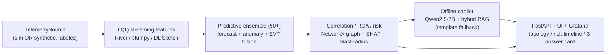

# NETRA

### Network Early-warning, Telemetry & Reasoning Assistant
*An air-gapped, offline predictive AI copilot for secure SD-WAN-over-MPLS network operations.*

> *नेत्र (netra) — "eye" in Sanskrit. NETRA gives the NOC foresight: it sees failures coming.*

**Hackathon Problem Statement 13 — Air-Gapped Predictive Copilot for Secure MPLS Operations.**

---

## The problem

Enterprise and government networks run SD-WAN over MPLS underlays across many branches, datacenters and hubs. Operating them today has two compounding gaps:

- **Reactive detection.** Threshold alerts fire only *after* users already feel the degradation — no time to intervene.
- **Air-gap constraints.** Regulated environments forbid cloud AI, leaving operators without intelligent guidance exactly where security matters most.

The NOC needs to answer three questions *before* impact, with **zero dependency on any external network**:

- **Q1 — What is likely to fail next, and when?**
- **Q2 — Why is risk elevated — which signals contributed?**
- **Q3 — What corrective action should be taken before SLA or security impact?**

## The NETRA solution

NETRA is a fully offline NOC copilot that **forecasts degradation with actionable lead time**, **explains its reasoning in grounded natural language**, and **recommends approval-gated remediation** — all inside the air-gapped boundary, verifiably.

- **Predict, don't react.** A 50+ method predictive ensemble (forecasting + anomaly + change-point + graph) detects *precursor conditions*, not threshold breaches, and computes a calibrated **time-to-impact**.
- **Explain, don't hallucinate.** SHAP attributions + graph root-cause analysis feed a quantized local LLM whose output is **schema-constrained, cited, and grounded** only in internal artifacts (topology, runbooks, past incidents) — with an offline faithfulness gate and an abstain flag.
- **Act, with a human in the loop.** The copilot retrieves the matching playbook and proposes ordered, rollback-capable steps that require operator approval.

## Runs fully offline, on a plain CPU box, with no GPU — the core promise

NETRA is engineered so the **entire pipeline runs end-to-end on a laptop-class CPU with no internet and no GPU**. Two design decisions make this true:

1. **Dual-source telemetry abstraction.** The same `TelemetrySource` interface is satisfied by *either* the live Containerlab sim *or* a high-fidelity **synthetic scenario generator** that replays the four validation scenarios with ground-truth labels. No sim, no Docker, no problem — the synthetic source feeds the identical pipeline.
2. **Graceful degradation.** Every heavy component degrades cleanly: if the 7B LLM is absent, a **deterministic template copilot emits the exact same structured response** so the system still runs and is testable; if there's no GPU, the CPU statistical + gradient-boosted + change-point + graph ensemble carries the analytics.

The heavy stack (Containerlab, GPU deep models, the quantized LLM, the RAG vector DB) **upgrades quality** but is never required to run, demo, or pass the air-gap conformance test.

## Architecture at a glance



| Phase | What it does | Locked stack |
|---|---|---|
| 1 — Simulation | Multi-site SD-WAN/MPLS lab + labeled fault injection | Containerlab + netlab + FRR/SR Linux + strongSwan |
| 2 — Telemetry | Collect + bus + **O(1) streaming features** | gnmic/Telegraf → NATS JetStream → River/stumpy → VictoriaMetrics |
| 3 — Predictive | 50+ method ensemble → calibrated risk + time-to-impact | River/pyod/statsmodels/ruptures + LightGBM + survival + conformal |
| 4 — Correlation | Graph RCA + blast-radius + prioritised incidents | NetworkX + Granger + SHAP + Platt calibration |
| 5 — Copilot | Grounded NL answers + playbooks | llama.cpp Qwen2.5-7B (GBNF) + bge-m3/Qdrant RAG + HHEM gate |
| 6 — Air-gap | Zero-egress enforcement + **verifiable** proof | nftables + Falco + pytest conformance + offline bundle |

Full design and rationale: **[ARCHITECTURE.md](ARCHITECTURE.md)**. The seven deep-research dossiers that back every decision: **[research/](research)**.

## Repository layout

```
ARCHITECTURE.md          Master architecture (start here)
docs/BUILD_PLAN.md       Workstream ownership map (who builds what)
netra/contracts/         Shared Pydantic v2 data contracts (the stable interface)
netra/                   The product: datagen · streaming · analytics · copilot · api
sim/ telemetry/          Phase 1 lab + Phase 2 collector configs
corpus/                  Sample runbooks / incidents / topology for RAG
ui/ grafana/             Operator console + dashboards
security/ tests/airgap/  Air-gap enforcement + conformance test
scripts/                 Offline bundling (docker save, pinned wheels, SBOM)
research/                The 7 deep-research reports
```

## Quickstart (placeholder — the integrator finalises commands)

> NETRA is designed to be installed and run with **no internet**. The commands
> below are the intended shape; the integrator finalises them once the build
> workstreams land.

```bash
# 1. Install the light core tier (the only tier required for the CPU-only demo)
python -m venv .venv && . .venv/bin/activate
pip install -r requirements-core.txt          # offline: --no-index --find-links=wheelhouse

# 2. Verify the shared contracts import (no heavy deps, just pydantic)
python -c "import netra.contracts; print('contracts OK')"

# 3. Run the end-to-end demo against the SYNTHETIC source (no sim, no GPU, no internet)
#    -> synthetic telemetry → streaming features → ensemble → risk → template copilot → UI
#    (entrypoint provided by the API/datagen workstreams)

# 4. (optional) Bring up the full offline stack
docker compose up -d                           # internal-only network

# 5. Prove the air-gap — passes only if every egress attempt is blocked
pytest -q tests/airgap
```

For the full offline bundle (`docker save` images + hash-pinned wheels + SBOM +
cosign), see `scripts/` and [ARCHITECTURE.md §8–§9](ARCHITECTURE.md).

## Evaluation alignment

| Dimension | Weight | How NETRA scores |
|---|---|---|
| Technical Merit | 35% | Precursor forecasting + survival + conformal bands → early, calibrated lead time; 50+ method cross-verified ensemble with EVT thresholds; reproducible ground-truth scoring |
| Copilot Effectiveness | 35% | Schema-constrained, cited, grounded answers over internal artifacts only; offline faithfulness gate + abstain; deterministic fallback always answers Q1/Q2/Q3 |
| Security & Offline Compliance | 20% | Defense-in-depth zero-egress + always-on monitor + **runnable conformance test**; telemetry-free software; hermetic hash-pinned supply chain |
| Documentation Quality | 10% | This README + master architecture + research dossiers + self-documenting typed contracts + unambiguous build plan |

## License

Apache-2.0. All bundled models and dependencies are permissively licensed
(Apache-2.0 / MIT) and air-gap-redistributable.
