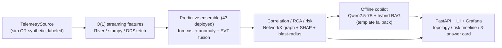

# NETRA

### Network Early-warning, Telemetry & Reasoning Assistant
*An air-gapped, offline predictive AI copilot for secure SD-WAN-over-MPLS network operations.*

> *नेत्र (netra) — "eye" in Sanskrit. NETRA gives the NOC foresight: it sees failures coming.*

**Hackathon Problem Statement 13 — Air-Gapped Predictive Copilot for Secure MPLS Operations.**

---

## The problem

Enterprise and government networks run SD-WAN over MPLS underlays across many branches, datacenters and hubs. Operating them today has two compounding gaps:

- **Reactive detection.** Threshold alerts fire only *after* users already feel the degradation — no time to intervene.
- **Air-gap constraints.** Regulated environments forbid cloud AI, leaving operators without intelligent guidance exactly where security matters most.

The NOC needs to answer three questions *before* impact, with **zero dependency on any external network**:

- **Q1 — What is likely to fail next, and when?**
- **Q2 — Why is risk elevated — which signals contributed?**
- **Q3 — What corrective action should be taken before SLA or security impact?**

## The NETRA solution

NETRA is a fully offline NOC copilot that **forecasts degradation with actionable lead time**, **explains its reasoning in grounded natural language**, and **recommends approval-gated remediation** — all inside the air-gapped boundary, verifiably.

- **Predict, don't react.** A **43-method deployed ensemble** (forecasting + anomaly + change-point + graph + survival; 50+ catalogued) detects *precursor conditions*, not threshold breaches, and computes a calibrated **time-to-impact**.
- **Explain, don't hallucinate.** SHAP attributions + graph root-cause analysis feed a quantized local LLM whose output is **schema-constrained, cited, and grounded** only in internal artifacts (topology, runbooks, past incidents) — with an offline faithfulness gate and an abstain flag.
- **Act, with a human in the loop.** The copilot retrieves the matching playbook and proposes ordered, rollback-capable steps that require operator approval.

## Runs fully offline, on a plain CPU box, with no GPU — the core promise

NETRA is engineered so the **entire pipeline runs end-to-end on a laptop-class CPU with no internet and no GPU**. Two design decisions make this true:

1. **Dual-source telemetry abstraction.** The same `TelemetrySource` interface is satisfied by *either* the live Containerlab sim *or* a high-fidelity **synthetic scenario generator** that replays the four validation scenarios with ground-truth labels. No sim, no Docker, no problem — the synthetic source feeds the identical pipeline.
2. **Graceful degradation.** Every heavy component degrades cleanly: if the 7B LLM is absent, a **deterministic template copilot emits the exact same structured response** so the system still runs and is testable; if there's no GPU, the CPU statistical + gradient-boosted + change-point + graph ensemble carries the analytics.

The heavy stack (Containerlab, GPU deep models, the quantized LLM, the RAG vector DB) **upgrades quality** but is never required to run, demo, or pass the air-gap conformance test.

## Architecture at a glance



| Phase | What it does | Locked stack |
|---|---|---|
| 1 — Simulation | Multi-site SD-WAN/MPLS lab + labeled fault injection | Containerlab + netlab + FRR/SR Linux + strongSwan |
| 2 — Telemetry | Collect + bus + **O(1) streaming features** | gnmic/Telegraf → NATS JetStream → River/stumpy → VictoriaMetrics |
| 3 — Predictive | 43-method deployed ensemble (50+ catalogued) → calibrated risk + time-to-impact | River/pyod/statsmodels/ruptures + LightGBM + survival + conformal |
| 4 — Correlation | Graph RCA + blast-radius + prioritised incidents | NetworkX + Granger + SHAP + Platt calibration |
| 5 — Copilot | Grounded NL answers + playbooks | llama.cpp Qwen2.5-7B (GBNF) + bge-m3/Qdrant RAG + HHEM gate |
| 6 — Air-gap | Zero-egress enforcement + **verifiable** proof | nftables + Falco + pytest conformance + offline bundle |

Full design and rationale: **[ARCHITECTURE.md](ARCHITECTURE.md)**. The seven deep-research dossiers that back every decision: **[research/](research)**.

## Repository layout

```
ARCHITECTURE.md          Master architecture (start here)
docs/BUILD_PLAN.md       Workstream ownership map (who builds what)
docs/DEMO.md             How to run the demo + what each scenario shows
docs/EVALUATION.md       Rubric → concrete evidence map
netra/contracts/         Shared Pydantic v2 data contracts (the stable interface)
netra/                   The product: datagen · streaming · analytics · copilot · api · pipeline
sim/ telemetry/          Phase 1 lab + Phase 2 collector configs
corpus/                  Sample runbooks / incidents / topology for RAG
ui/ grafana/             Operator console + dashboards
security/ tests/airgap/  Air-gap enforcement + conformance test
scripts/                 Offline bundling (docker save, pinned wheels, SBOM) + demo.py
docker-compose.yml       Offline stack (NATS · VictoriaMetrics · Grafana · netra-app; profiles: sim/llm/vectordb)
docker/Dockerfile        Slim CPU image for netra-app (core tier)
Makefile                 setup · demo · test · up · airgap-verify · bundle …
research/                The 7 deep-research reports
```

## Quickstart

> Everything below runs **fully offline on a plain CPU box** — no GPU, no
> internet, no sim. The CPU-only demo/eval path needs only the light **core**
> tier (`requirements-core.txt`). The heavy stack (LLM, deep models, RAG vector
> DB, Containerlab) upgrades quality but is never required.

```bash
# 1. Install the core tier into a venv (the only tier the demo needs).
make setup
#    equivalently:
#    python -m venv .venv && . .venv/bin/activate && pip install -r requirements-core.txt
#    offline build host: pip install --no-index --find-links=wheelhouse -r requirements-core.txt

# 2. Run the end-to-end demo over all four validation scenarios (CPU-only, offline).
#    synthetic telemetry → O(1) streaming features → 43-method ensemble →
#    fusion/correlation/risk → template-fallback copilot → Q1/Q2/Q3 + lead time.
make demo
#    one scenario:  PYTHONPATH=. python scripts/demo.py --scenario A
#    or the wrapper: scripts/run_demo.sh

# 3. Run the test suite (229 tests; air-gap tests run LENIENT off the appliance).
make test

# 4. (optional) Bring up the full offline stack on the internal-only network.
make up                       # NATS + VictoriaMetrics + Grafana + netra-app
#    → UI/API at http://127.0.0.1:8000   ·   Grafana at http://127.0.0.1:3000
#    hardened appliance (adds Falco egress monitor + LLM seccomp):
#    make up-secure            # docker compose -f docker-compose.yml -f security/compose.security.yml up -d

# 5. Prove the air-gap — active egress conformance + passive evidence.
make airgap-verify            # scripts/airgap_verify.sh  (pytest tests/airgap + nftables/conntrack/Falco)
```

See **[docs/DEMO.md](docs/DEMO.md)** for the full demo walkthrough and
**[docs/EVALUATION.md](docs/EVALUATION.md)** for the rubric-to-evidence map. For
the offline install bundle (`docker save` images + hash-pinned wheels + SBOM +
copyleft-free license report), see `make bundle` / `make install-offline` and
[ARCHITECTURE.md §8–§9](ARCHITECTURE.md).

## Demo results — 4/4 scenarios detected with lead time

End-to-end, fully offline, CPU-only, template-fallback copilot (`make demo`).
Each scenario is detected **before** the labeled fault, with a calibrated lead
time and the correct predicted issue (Q1/Q2/Q3 answered for every one):

| Scenario (`ScenarioId`) | Predicted issue | Detected? | Lead time | Top method |
|---|---|---|---|---|
| **A — Progressive congestion** (`A_congestion`) | `interface_congestion` | ✅ | **2.4 min** | EWMA/Page-Hinkley drift |
| **B — BGP route-flap cascade** (`B_bgp_flap`) | `bgp_route_flap` | ✅ | **1.5 min** | route-flap churn + change-point |
| **C — Intermittent tunnel degradation** (`C_tunnel_degradation`) | `tunnel_degradation` | ✅ | **1.8 min** | Half-Space-Trees / COPOD |
| **D — Controller policy drift** (`D_policy_drift`) | `policy_drift` | ✅ | **0.2 min** | BOCPD/PELT step change |

**Result: 4/4 detected with lead time** — fully offline, CPU-only, no GPU, no
model. The same run prints the per-scenario Q1/Q2/Q3 operator card and a summary
table; pass `--json out.json` for a machine-readable summary.

## Evaluation alignment

Full rubric-to-evidence map with file/line citations: **[docs/EVALUATION.md](docs/EVALUATION.md)**.

| Dimension | Weight | How NETRA scores |
|---|---|---|
| Technical Merit | 35% | Precursor forecasting + survival + conformal bands → early, calibrated lead time; 43-method cross-verified ensemble (50+ catalogued, `netra/analytics/fusion/registry.py`) with EVT thresholds; 4/4 detection with measured lead times; reproducible ground-truth scoring |
| Copilot Effectiveness | 35% | Schema-constrained, cited, grounded `CopilotResponse` over internal artifacts only; GBNF grammar; offline faithfulness gate + abstain; deterministic template fallback always answers Q1/Q2/Q3 |
| Security & Offline Compliance | 20% | Defense-in-depth zero-egress (nftables FORWARD/DOCKER-USER + `internal: true`) + always-on Falco monitor + **runnable pytest conformance test**; copyleft-free permissive bundle; hash-verified offline installer |
| Documentation Quality | 10% | This README + [ARCHITECTURE.md](ARCHITECTURE.md) + [docs/DEMO.md](docs/DEMO.md) + [docs/EVALUATION.md](docs/EVALUATION.md) + 7 research dossiers + self-documenting typed contracts |

## License

Apache-2.0. All bundled models and dependencies are permissively licensed
(Apache-2.0 / MIT) and air-gap-redistributable.
