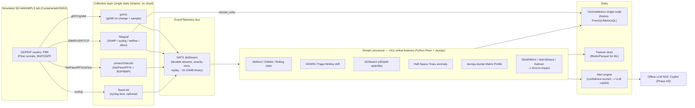

# Phase 2 — Telemetry Collection & Streaming Pipeline

**Project:** Air-Gapped Predictive Copilot for Secure MPLS Operations (PS-13)
**Scope of this report:** Telemetry collection, streaming bus + storage, and **O(1) / streaming-first processing** for low-latency precursor detection.
**Hard constraints:** air-gapped/offline, free & open-source, smallest footprint, lowest end-to-end latency, single-node or small-cluster.
**Date:** 2026-06-20

---

## 0. Executive Recommendation (TL;DR)

For an air-gapped, single-node-to-small-cluster SD-WAN/MPLS lab where the win condition is **prediction lead time** (forecast degradation before SLA breach), pick the stack that minimizes (a) operational footprint and (b) **per-update processing latency**, while keeping every byte inside the boundary.

**Recommended stack:**

| Layer | Recommendation | Why |
|---|---|---|
| **Streaming telemetry collector** | **gnmic** (gNMI dial-out/dial-in) + **Telegraf** (SNMP, syslog, NetFlow/IPFIX) | Single static Go binaries, no cloud deps, native outputs to NATS/Prometheus/VictoriaMetrics. gnmic owned by OpenConfig group; Telegraf covers everything gNMI can't. |
| **Flow records (NetFlow/IPFIX/sFlow)** | **pmacct / nfacctd** (or Telegraf `netflow` plugin for a thinner lab) | Purpose-built passive flow collector; correlates BGP/BMP/IGP + flows; aggressive in-collector aggregation/sampling reduces volume. |
| **Event/telemetry bus** | **NATS JetStream** (primary). Redpanda if you need full Kafka API. | Single 10–15 MB Go binary, JetStream adds at-least-once **and exactly-once** + durable consumers + replay in the *same* binary. Sub-cluster footprint beats Kafka by a wide margin. |
| **Time-series store** | **VictoriaMetrics single-node** (+ `vmagent`) | Best ingestion/query per CPU at high cardinality, ~70x less disk than TimescaleDB, on-disk buffering for outages, PromQL/MetricsQL, single binary. |
| **Online ML / streaming features** | **Python `River`** (online stats, drift, anomaly, online forest) + **`stumpy.stumpi`** (streaming Matrix Profile) + **`ddsketch`** (streaming quantiles) | Every operator is **O(1) or amortized O(1) per update** — exactly what "time-to-impact" needs. |
| **Logs / syslog normalization** | **fluent-bit** (if you need a log pipeline distinct from metrics) | ~1 MB C binary, lowest-footprint log shipper; Vector.dev if you want one Rust binary doing logs+metrics+transforms. |

**One-line rationale:** *gnmic+Telegraf → NATS JetStream → River/stumpy online features → {VictoriaMetrics for history, feature store for ML, alert engine}.* Everything is a single static binary or a `pip install`, runs offline, and the processing layer is O(1)-per-sample so precursor scores update in microseconds-to-milliseconds rather than waiting for a batch window.

---

## 1. Telemetry Sources & Collectors

### 1.1 The five signal classes we must ingest (from PS-13 dataset spec)

| Signal class | Protocol/transport | Predictive value (what it feeds) |
|---|---|---|
| **Interface counters** — utilization, latency, jitter, errors/discards | SNMP poll **or** gNMI streaming (OpenConfig `/interfaces/interface/state/counters`) | Congestion buildup, utilization saturation, error-rate acceleration |
| **Syslog** | RFC 5424/3164 syslog over UDP/TCP | Protocol flaps, link up/down, rekey events, config-change drift |
| **Routing events** — BGP/OSPF adjacency, route advertisements | syslog + BMP (BGP Monitoring Protocol) + gNMI BGP/OSPF state paths | Routing instability, convergence stress, route-flap precursors, path asymmetry |
| **NetFlow / IPFIX flow records + tunnel stats** | NetFlow v5/v9, IPFIX, sFlow | Traffic-matrix shifts, micro-bursts, tunnel byte/packet/loss progression |
| **Model-driven streaming telemetry** | gNMI (gRPC) dial-in/dial-out, OpenConfig YANG, sFlow | Sub-second on-change deltas, vendor-native counters without poll lag |

### 1.2 Collector comparison

| Collector | Lang / footprint | Best at | gNMI | SNMP | NetFlow/IPFIX | sFlow | Syslog | BGP/BMP | Native outputs | Air-gap notes |
|---|---|---|---|---|---|---|---|---|---|---|
| **gnmic** | Go, single static binary, no deps | Model-driven streaming (gNMI Subscribe) | ✅ native (Get/Set/Subscribe, dial-out) | ➖ (output target only) | ❌ | ❌ | ❌ | ➖ | NATS, Kafka, Prometheus, InfluxDB, TCP/UDP, file | OpenConfig-group project; clustering with REST API; ideal collector core |
| **Telegraf** | Go, single binary | Swiss-army agent (SNMP+gNMI+netflow+syslog) | ✅ (`gnmi` input, renamed from Cisco gNMI in 1.15) | ✅ (`snmp` input, OID + table) | ✅ (`netflow` input: v5/v9/IPFIX) | ✅ (`sflow`) | ✅ (`syslog`) | ➖ | InfluxDB, Prometheus **remote_write → VictoriaMetrics**, Kafka, file, many | One binary covers all 5 signal classes; easiest single-tool lab |
| **pmacct / nfacctd** | C, tiny | High-volume flow accounting + correlation | ✅ (streaming telemetry) | ➖ | ✅ (nfacctd: NetFlow v9/IPFIX) | ✅ (sfacctd) | ❌ | ✅ (BGP, BMP, RPKI, IGP) | Kafka, RabbitMQ, files, SQL | Pluggable; **in-collector aggregation/filtering/sampling** → big data-reduction; best if flow volume is heavy |
| **snmp_exporter** | Go | Prometheus-native SNMP scrape | ❌ | ✅ | ❌ | ❌ | ❌ | ❌ | Prometheus scrape | Use only if you commit fully to Prometheus scrape model |
| **fluent-bit** | C, ~1 MB | Lowest-footprint log/syslog shipping | ❌ | ❌ | ❌ | ❌ | ✅ | ❌ | many (forward, file, HTTP) | Best pure-log footprint; pair with metrics collector |
| **fluentd** | Ruby+C | Flexible log routing | ❌ | ❌ | ❌ | ❌ | ✅ | ❌ | many | Heavier than fluent-bit; only if you need its plugin ecosystem |
| **Vector.dev** | Rust, single binary | One binary for logs+metrics+transforms (VRL) | ➖ | ➖ | ✅ (`netflow` source) | ➖ | ✅ | ❌ | Kafka, NATS, Prometheus, files, many | Strong "single Rust binary" option; in-pipeline transforms via VRL |
| **Logstash** | JVM | Heavy ETL on logs | ❌ | ➖ | ➖ | ❌ | ✅ | ❌ | Elasticsearch, Kafka, many | Heaviest (JVM); avoid for footprint-constrained air-gap |

Sources: [Nokia gnmic blog](https://www.nokia.com/blog/streaming-telemetry-with-open-source-gnmic/), [gnmic docs](https://gnmic.openconfig.net/), [InfluxData gNMI+SNMP+Telegraf](https://www.influxdata.com/resources/how-to-introduce-telemetry-streaming-gnmi-in-your-network-with-snmp-with-telegraf/), [Telegraf SNMP input](https://docs.influxdata.com/telegraf/v1/input-plugins/snmp/), [Telegraf plugin directory](https://docs.influxdata.com/telegraf/v1/plugins/), [pmacct GitHub](https://github.com/pmacct/pmacct), [Netflix gnmi-gateway](https://netflixtechblog.com/simple-streaming-telemetry-27447416e68f).

### 1.3 Minimal-overhead collection layer — recommendation

**Two-binary core for the lab:**

1. **gnmic** as the streaming-telemetry collector (gNMI Subscribe in `on-change` + `sample` modes). gNMI on-change pushes deltas the instant a counter/state flips — no poll interval lag — which directly improves precursor lead time. Distributed as a *statically linked single Go binary, no external dependencies*, with clustering + REST API for HA if you grow to a small cluster ([gnmic docs](https://gnmic.openconfig.net/)).
2. **Telegraf** for everything containerlab nodes still expose only via SNMP/syslog/NetFlow (FRR, classic IOS images, Linux hosts). Its `snmp`, `gnmi`, `netflow`, `sflow`, and `syslog` inputs cover all five PS-13 signal classes in one config, and it writes straight to VictoriaMetrics via Prometheus `remote_write` ([VictoriaMetrics Telegraf integration](https://docs.victoriametrics.com/victoriametrics-cloud/integrations/telegraf/)).

Add **pmacct/nfacctd** only if NetFlow/IPFIX volume is large — its in-collector aggregation/sampling is the cheapest way to cut flow-record volume before it hits the bus ([pmacct overview](https://github.com/pmacct/pmacct)). Add **fluent-bit** only if you want a log lane physically separate from the metrics lane.

Why on-change/streaming over SNMP polling: SNMP polls at fixed intervals (e.g., 30–60 s), so a 5-second precursor is invisible until the next poll. gNMI `on-change`/`sample(1s)` and sFlow give sub-second granularity, which is the raw material for short-horizon "time-to-impact."

---

## 2. Streaming Bus & Storage

### 2.1 Event/telemetry bus comparison (air-gapped, low-footprint)

| Bus | Lang / footprint | Durability / delivery | Throughput (1 KB) | p99 latency | Air-gap / single-node fit | Verdict for PS-13 |
|---|---|---|---|---|---|---|
| **NATS JetStream** | Go, ~10–15 MB single binary | Persistent streams, **at-least-once AND exactly-once**, durable consumers, replay, max-deliver | ~820k msg/s produce, ~750k consume; JetStream layer ~1M msg/s | ~3.2 ms | **Best.** Whole broker + persistence in one tiny binary, no JVM, no ZooKeeper | **Primary choice** |
| **Redpanda** | C++, single binary, no JVM/ZooKeeper, Raft built-in | Kafka-compatible, at-least-once, idempotent/transactional producers | Matches/beats Kafka single-node | ~10x lower than Kafka | Good. 1 core + 1 GiB for test; ≥2 GB RAM/core recommended | **Pick if you need the full Kafka API** (e.g., existing Kafka clients, Connect) |
| **Apache Kafka** | JVM + ZooKeeper/KRaft | Strong, at-least-once, exactly-once via transactions | ~1.2M msg/s batched | ~12.5 ms | Heavy: JVM heap + (ZooKeeper min 4 GB RAM, 3-node ensemble for prod) or KRaft | **Avoid** for footprint-constrained air-gap |
| **Redis Streams** | C, tiny | At-most/at-least-once, consumer groups, in-memory + optional persistence | ~480k produce / ~520k consume | **~0.8 ms (lowest)** | In-memory; retention bounded by RAM | **Good for <10k msg/s** or as a hot scratch/feature cache, not durable system-of-record |

Numbers: [Kafka vs Redis vs NATS 2026 benchmark](https://dev.to/young_gao/real-time-event-streaming-kafka-vs-redis-streams-vs-nats-in-2026-34o1), [broker comparison 2025](https://medium.com/@BuildShift/kafka-is-old-redpanda-is-fast-pulsar-is-weird-nats-is-tiny-which-message-broker-should-you-32ce61d8aa9f), [NATS JetStream consumers](https://docs.nats.io/nats-concepts/jetstream/consumers), [NATS vs Redis vs Kafka](https://www.index.dev/skill-vs-skill/nats-vs-redis-vs-kafka), [Redpanda sizing](https://docs.redpanda.com/current/deploy/redpanda/manual/sizing/), [Redpanda vs Kafka](https://www.redpanda.com/compare/redpanda-vs-kafka), [ZooKeeper production sizing](https://docs.confluent.io/platform/7.3/zookeeper/deployment.html).

**Recommendation:** **NATS JetStream** is the sweet spot for an air-gapped single node: a single ~10–15 MB binary gives you persistent streams, durable consumers, replay, and *exactly-once* — capabilities that otherwise require Kafka + ZooKeeper/KRaft + JVM. If a teammate's component speaks only Kafka protocol, drop in **Redpanda** (single C++ binary, Kafka-API-compatible, no ZooKeeper). Keep **Redis Streams** in reserve as a sub-millisecond hot buffer / online feature cache for the ML layer, not as the durable bus.

### 2.2 Time-series store comparison (high-cardinality network telemetry)

Per-device-per-interface-per-metric labels make network telemetry **high-cardinality** (thousands–millions of series). The store must keep ingesting and answering fast range queries without RAM blowup.

**High-cardinality benchmark (datapoints/sec ingest, RAM, disk):**

| Series count | Metric | **VictoriaMetrics** | InfluxDB | TimescaleDB |
|---|---|---|---|---|
| **400K** | Ingest | 2.6M dp/s | 1.2M dp/s | 849K dp/s |
| | RAM | 3 GB | 8.5 GB | 2.5 GB |
| | Disk | **965 MB** | 1.6 GB | 50 GB |
| **4M** | Ingest | **2.2M dp/s** | 330K dp/s | 480K dp/s |
| | RAM | 6 GB | 20.5 GB | 2.5 GB |
| | Disk | **3 GB** | 18.4 GB | 52 GB |
| **40M** | Ingest | **1.7M dp/s** | *Failed (>60 GB RAM)* | 330K dp/s |
| | RAM | 29 GB | N/A | 2.5 GB |
| | Disk | **17 GB** | N/A | 84 GB |

Source: [High-cardinality TSDB benchmarks: VictoriaMetrics vs TimescaleDB vs InfluxDB (Valyala/VictoriaMetrics)](https://valyala.medium.com/high-cardinality-tsdb-benchmarks-victoriametrics-vs-timescaledb-vs-influxdb-13e6ee64dd6b).

| Store | Model / query lang | Footprint | High-cardinality behavior | Best for | PS-13 verdict |
|---|---|---|---|---|---|
| **VictoriaMetrics** | PromQL/MetricsQL, single binary (+vmagent) | Smallest disk; uses ~all CPU efficiently; ~70x less disk than TimescaleDB | Advanced inverted index built for high cardinality; ingest barely degrades 400K→40M series | Infra/network metrics, fast range queries per CPU | **Primary TSDB** |
| **Prometheus** | PromQL, single binary | Light, but local TSDB not built for very high cardinality / long retention | OK at modest scale; struggles at very high cardinality/retention | Quick start, scrape model | Fine for a tiny lab; swap to VM as cardinality grows |
| **QuestDB** | SQL + InfluxDB Line Protocol (ILP) | Lean | Built for sustained millions of rows/s ingest on modest HW | When ingest rate is the bottleneck and you want SQL | Strong alt if you prefer SQL/ILP |
| **TimescaleDB** | Full SQL (Postgres ext.) | Low, stable RAM but **large disk** (50–84 GB in bench) | Stable RAM, big disk footprint | Rich SQL joins with relational data | Use if you need SQL joins; watch disk |
| **InfluxDB** | Flux/InfluxQL | Heavy RAM at high cardinality | **Degrades badly** (1.2M→330K dp/s; failed at 40M) | Low/medium cardinality | **Avoid** for high-cardinality network data |

Sources: [VictoriaMetrics FAQ](https://docs.victoriametrics.com/victoriametrics/faq/), [Last9 high-cardinality](https://last9.io/blog/performance-implications-of-high-cardinality-in-time-series-databases/), [TimescaleDB alternatives (Tinybird)](https://www.tinybird.co/blog/TimescaleDB-TigerData-Alternatives).

**Recommendation — best ingestion/query performance per CPU:** **VictoriaMetrics single-node**. It wins the high-cardinality benchmark on ingest-per-CPU and by a huge margin on disk (965 MB vs InfluxDB 1.6 GB vs TimescaleDB 50 GB at 400K series), uses CPU efficiently, speaks PromQL/MetricsQL, and ships as a single binary. Front it with **`vmagent`**, which "usually requires less CPU, RAM and disk IO than the Prometheus agent" and **buffers on disk** when the destination is briefly unavailable — exactly what you want on a constrained air-gapped node ([VM single-node](https://docs.victoriametrics.com/victoriametrics/single-server-victoriametrics/), [vmagent](https://docs.victoriametrics.com/victoriametrics/vmagent/)). Keep **TimescaleDB** only if Phase-3 needs relational SQL joins of telemetry with topology tables.

---

## 3. O(1) / Streaming-First Processing — **THE CRITICAL SECTION**

### 3.1 Why O(1) streaming matters for precursor detection (vs batch)

The PS-13 win condition is **lead time**: forecast degradation *before* SLA/security impact, and emit a "time-to-impact." Two reasons streaming/online beats batch here:

1. **Latency.** A batch job recomputes statistics over a window every N seconds/minutes; the precursor signal is invisible until the next batch fires. An **O(1)-per-update** operator folds each new sample into a running statistic in microseconds, so the anomaly/drift/quantile score is *always current*. Lead time you don't burn waiting for a batch boundary is lead time the NOC gets to act.
2. **Footprint.** O(1)/sublinear streaming algorithms keep **constant memory** regardless of stream length (they summarize, never store the full history). On a single air-gapped node this is the difference between fitting in RAM and not.

Batch models (LSTM/Prophet, the PS-13 "suggested" tools) still have a role for *training on historical labeled faults* (Phase 3). But the **real-time scoring path** should be online/O(1) so it can run continuously per-interface/per-tunnel without unbounded cost. Online learners (River) also adapt to **concept drift** (traffic patterns shift after a failure) without retraining from scratch — see the Liquid-NN vs incremental-learning study on link-load prediction amid drift ([arXiv 2404.05304](https://arxiv.org/pdf/2404.05304)).

### 3.2 Enumerated O(1) / streaming algorithms — with exact library + function names

Legend: **Cost** = per-update time. River = `pip install river`; stumpy = `pip install stumpy`; ddsketch = `pip install ddsketch`.

#### A. Online moments & smoothing (running stats)

| Algorithm | What it gives | Cost | Library + exact symbol |
|---|---|---|---|
| **Welford online mean/variance** | Numerically-stable streaming mean & variance, no history stored | **O(1)** | `river.stats.Mean`, `river.stats.Var` (Welford update). Standalone: [jvf/welford](https://github.com/jvf/welford) |
| **EWMA / EWMVar** (exp-weighted mean/variance) | Recency-weighted mean & variance; forgetting factor α | **O(1)** | `river.stats.EWMean(fading_factor=...)`, `river.stats.EWVar(fading_factor=...)` |
| **Rolling window stats** | Mean/var/min/max/sum over last *w* samples | **O(1)** amortized | `river.stats.RollingMean`, `RollingVar`, `Rolling(...)` wrappers; ring buffer underneath |
| **Z-score / Gaussian scorer** | Standardized anomaly score from running mean/var | **O(1)** | `river.anomaly.GaussianScorer` (wraps a running Gaussian) |

Welford is the canonical O(1) streaming mean/variance and is numerically stable vs the naive sum-of-squares ([Welford's method, EmbeddedRelated](https://www.embeddedrelated.com/showarticle/785.php); [Welford derivation](https://changyaochen.github.io/welford/)).

#### B. Streaming change / drift detection (the precursor triggers)

| Algorithm | What it detects | Cost | Library + exact symbol |
|---|---|---|---|
| **ADWIN** (ADaptive WINdowing) | Distribution change in a stream; auto-resizes window | ~**O(log w)** amortized, O(1)-ish per item | `river.drift.ADWIN` |
| **Page-Hinkley** (CUSUM variant) | Mean shift via cumulative deviation + forgetting factor α | **O(1)** (few running scalars) | `river.drift.PageHinkley` |
| **CUSUM / Page-Hinkley test** | Cumulative-sum threshold crossing | **O(1)** | `river.drift.PageHinkley` (PH is the CUSUM-family detector in River) |
| **KSWIN** (Kolmogorov-Smirnov windowing) | Distribution change via KS test on a sliding window | O(window) per check | `river.drift.KSWIN` |
| **DDM / EDDM** | Concept drift from classifier error rate | **O(1)** | `river.drift.binary.DDM`, `river.drift.binary.EDDM` |

Page-Hinkley "maintains only a few running statistics … computationally efficient and suitable for high-speed data streams and resource-constrained environments," processing one point at a time with no history stored — ideal for per-interface drift ([Page-Hinkley, GeeksforGeeks](https://www.geeksforgeeks.org/artificial-intelligence/page-hinkley-method/); [River PageHinkley](https://riverml.xyz/dev/api/drift/PageHinkley/)). ADWIN/DDM/EDDM are River's drop-in drift modules that can trigger model resets/swaps ([River drift overview](https://riverml.xyz/latest/api/overview/)).

#### C. Streaming quantiles & histograms (latency/jitter tails)

| Algorithm | What it gives | Cost | Library + exact symbol |
|---|---|---|---|
| **DDSketch** | Quantiles with **relative-error guarantee**, fully mergeable | **O(1)** insert | `ddsketch.DDSketch(relative_accuracy=0.01)` → `.add(v)`, `.get_quantile_value(q)` ([PyPI](https://pypi.org/project/ddsketch/)) |
| **t-digest** | Accurate quantiles, esp. tails; mergeable | **O(1)** amortized | `tdigest` (PyPI) / `crick.TDigest`; concept: [t-digest paper](https://arxiv.org/pdf/1902.04023) |
| **P² / streaming quantile** | Single quantile (e.g., p99) w/o storing data | **O(1)** | `river.stats.Quantile(q=0.99)`, `river.stats.RollingQuantile` |

DDSketch is built for long-tailed latency data: relative-error guarantee `|x−y|/x < ε` for any quantile, memory "about as small as GK and multiple times smaller than HDR Histogram," ingest "10× faster than GK," and **fully mergeable** so per-device sketches combine on a central node ([Datadog DDSketch blog](https://www.datadoghq.com/blog/engineering/computing-accurate-percentiles-with-ddsketch/); [DDSketch paper](https://arxiv.org/pdf/1908.10693)). Use it for streaming p95/p99 **latency and jitter** per tunnel/interface.

#### D. Cardinality, heavy-hitters & membership (flow/traffic structure)

| Algorithm | What it gives | Cost | Library + exact symbol |
|---|---|---|---|
| **Count-Min Sketch** | Approx. frequency of keys (heavy talkers, top flows) in sublinear space | **O(d)** = O(1) (d hashes) | `probables.CountMinSketch` (`pip install pyprobables`); Redis `CMS.*`; concept [CMS Wikipedia](https://en.wikipedia.org/wiki/Count%E2%80%93min_sketch) |
| **HyperLogLog** | Approx. count of **distinct** items (unique src IPs, flows) | **O(1)** add | `datasketches.hll_sketch`; `redis PFADD/PFCOUNT`; [pyprobables HLL] |
| **Bloom / Counting Bloom** | Set membership (seen-before flow/prefix?) | **O(1)** | `probables.BloomFilter`, `CountingBloomFilter` |
| **Heavy-hitters / Top-K (sliding window)** | Most-frequent flows over a window | **O(1)** worst-case (FAST/Memento) | concept: [FAST O(1) heavy hitters](https://arxiv.org/pdf/1710.03155), [Memento sliding window](https://arxiv.org/pdf/1810.02899); Redis `TOPK.*` |
| **Reservoir sampling** | Uniform random sample of unbounded stream, fixed memory | **O(1)** per item | classic Vitter algorithm; trivial to implement; [survey](https://www.researchgate.net/publication/326369245) |
| **Ring buffer** | Fixed-size recent-window store backing rolling features | **O(1)** push/pop | `collections.deque(maxlen=w)`; backs River rolling stats |

These give the traffic-structure features (top talkers, unique-flow churn, micro-burst detection) cheaply, in constant memory — Count-Min and HyperLogLog are the standard sublinear network-monitoring sketches ([Count-Min Sketch, Redis](https://redis.io/blog/count-min-sketch-the-art-and-science-of-estimating-stuff/); [probabilistic structures, Aerospike](https://aerospike.com/blog/taking-advantage-of-probabilistic-data-structures/)).

#### E. Online anomaly detection & classifiers (precursor models)

| Algorithm | What it does | Cost | Library + exact symbol |
|---|---|---|---|
| **Half-Space-Trees (HST)** | Streaming, **unsupervised** anomaly detection; ensemble of random binary trees, mass per node | **O(1)** per update after build (constant-time ensemble; "training is linear in n", per-update constant) | `river.anomaly.HalfSpaceTrees(n_trees=..., height=..., window_size=...)` → `.learn_one(x)`, `.score_one(x)` |
| **One-Class SVM (online)** | Streaming novelty detection | O(1) incremental | `river.anomaly.OneClassSVM` |
| **Local Outlier Factor (incremental)** | Density-based outliers | streaming | `river.anomaly.LocalOutlierFactor` |
| **Predictive Anomaly Detection** | Anomaly via forecast residual | O(1) | `river.anomaly.PredictiveAnomalyDetection` |
| **Hoeffding Tree** | Online decision tree (supervised, e.g., fault/no-fault) | **O(1)** amortized per sample | `river.tree.HoeffdingTreeClassifier`, `HoeffdingAdaptiveTreeClassifier` |
| **Adaptive Random Forest (ARF)** | Online ensemble w/ built-in drift adaptation | O(1) amortized per tree | `river.forest.ARFClassifier` (and `ARFRegressor`) |

HST is the key unsupervised online anomaly detector: it "randomly constructs a binary tree, splits a random dimension in half, counts instances as 'mass,'" with anomaly score proportional to leaf mass; "an ensemble of such trees can be built in constant time." **Requirement:** features must be scaled to **[0,1]** (default `limits`), or pipe through `river.preprocessing.MinMaxScaler` ([River HalfSpaceTrees API](https://riverml.xyz/latest/api/anomaly/HalfSpaceTrees/); [detecting anomalies with HST, TDS](https://towardsdatascience.com/detecting-anomalies-in-data-streams-2daedbdaa436/)).

#### F. Streaming Matrix Profile & incremental forecasting (shape/seasonality)

| Algorithm | What it does | Cost | Library + exact symbol |
|---|---|---|---|
| **STUMPI (incremental Matrix Profile)** | Streaming discord/anomaly + motif detection on a time series; updates MP as each point arrives | **O(1)-amortized per new point** (incremental, not full recompute) | `stumpy.stumpi(T, m=window)` → object with **`.update(new_value)`**; read `.P_` (matrix profile) and `.I_` (indices). Discord = max of `.P_` ([stumpy streaming tutorial](https://stumpy.readthedocs.io/en/latest/Tutorial_Matrix_Profiles_For_Streaming_Data.html)) |
| **STAMPI** | Original incremental MP algorithm (STUMPI is the optimized impl) | incremental | underlying algorithm behind `stumpy.stumpi` |
| **SNARIMAX** | Online seasonal ARIMA + exogenous inputs; `learn_one`/`forecast` | **O(1)** per step | `river.time_series.SNARIMAX(p,d,q,m,sp,sd,sq, regressor=...)` |
| **Holt-Winters (online)** | Online triple-exponential smoothing (level/trend/season) | **O(1)** per step | `river.time_series.HoltWinters(...)` |
| **Online STL — OneShotSTL** | Seasonal-trend decomposition with **O(1) update**; >1000× faster than batch STL | **O(1)** update | reference impl from paper [OneShotSTL (arXiv 2304.01506)](https://arxiv.org/pdf/2304.01506); fall back to batch `statsmodels.tsa.STL` for offline analysis |
| **Kalman filter (incremental)** | Recursive state estimate/denoise/short-horizon predict; predict+update per sample | **O(1)** per step (fixed state dim) | `pykalman.KalmanFilter().filter_update(...)`; `filterpy.kalman.KalmanFilter.predict()/.update()` |
| **RobustSTL / batch STL** | Robust seasonal-trend decomposition (offline baseline) | batch | `statsmodels.tsa.seasonal.STL`; [statsmodels STL](https://www.statsmodels.org/dev/examples/notebooks/generated/stl_decomposition.html) |

`stumpy.stumpi` is the streaming workhorse: instantiate once over a seed window, then call `.update(x)` for every new sample; a subsequence whose matrix-profile value is large (nearest neighbor far away) is a **discord/anomaly**, so you watch `stream.P_[-1]` in real time ([stumpy stumpi tutorial](https://stumpy.readthedocs.io/en/latest/Tutorial_Matrix_Profiles_For_Streaming_Data.html); [Finding anomalies using STUMPI](https://github.com/stumpy-dev/stumpy/discussions/212)). OneShotSTL is the standout for online seasonality: **O(1) update time, >1000× faster than batch**, designed for online anomaly detection + forecasting ([OneShotSTL paper](https://arxiv.org/pdf/2304.01506)).

### 3.3 How these enable real-time "time-to-impact"

Pipeline per metric stream (e.g., `interface utilization`):
1. **Welford/EWMA** keep the running mean/slope (O(1)).
2. **Page-Hinkley/ADWIN** fire the instant the mean drifts upward (precursor trigger).
3. **DDSketch** tracks the p99 latency/jitter tail continuously.
4. **Half-Space-Trees / stumpi** score the multivariate / shape anomaly.
5. **SNARIMAX/Holt-Winters/Kalman** project the metric forward; the predicted time at which the trajectory crosses the SLA threshold **is** the time-to-impact estimate — computed online, refreshed every sample.

Because every step is O(1), the time-to-impact number is recomputed on each new telemetry point with microsecond-to-millisecond latency, giving the NOC the earliest possible lead time.

---

## 4. Pipeline Architecture (end-to-end, low-latency, air-gapped)



**Design notes:**

- **Windowing:** sliding/rolling windows (ring buffer = `deque(maxlen=w)`) back River rolling stats; tumbling windows for periodic rollups into VictoriaMetrics. Keep the *online* features windowless where possible (Welford/EWMA) so there's no window-boundary latency.
- **Backpressure:** NATS JetStream durable consumers + `vmagent` on-disk buffering absorb bursts; if the stream processor lags, JetStream retains and replays — no data loss, no upstream stall.
- **Delivery semantics:** **at-least-once** is the pragmatic default for telemetry (idempotent metric writes tolerate dupes); use JetStream **exactly-once** for the alert/event stream feeding the copilot so an alert isn't double-counted. (NATS JetStream supports at-most/at-least/exactly-once natively.)
- **Edge/footprint:** every component is a single static binary or a `pip` package — runs on one air-gapped node; scale to a 3-node small cluster only if you need HA (gnmic clustering, NATS cluster, VM cluster). No JVM, no ZooKeeper, no cloud SDK anywhere in the data path.
- **Air-gap integrity:** zero outbound calls — gnmic/Telegraf/NATS/VM are all offline-capable; pre-stage binaries + `pip wheelhouse` inside the boundary.

---

## 5. Feature Engineering for Network Precursors (online/rolling)

All features below are computed **online (O(1))** with the symbols from §3, per interface / tunnel / peer. These are the leading indicators that predict failure *before* a threshold breach (corroborated by [proactive soft-failure prediction, Nature Sci Rep](https://www.nature.com/articles/s41598-026-52186-3), which uses velocity/acceleration/rolling-stat features + tree ensembles, and [predictive maintenance overview](https://www.networkershome.com/fundamentals/ai-for-it/ai-predictive-maintenance/)).

| Precursor feature | Definition | Online computation (O(1)) | Signals failure of |
|---|---|---|---|
| **Rolling utilization slope** | d(util)/dt over window | `RollingMean` of deltas, or EWMA of first difference; slope = linear fit on ring buffer | Congestion buildup, link saturation |
| **Latency drift** | Upward shift in mean RTT | `EWMean` + `PageHinkley` on RTT | Path degradation, queue buildup |
| **Jitter trend** | Rising variance of inter-packet delay | `EWVar` / `RollingVar`; p99 via `DDSketch` | Tunnel instability, buffering |
| **Loss progression** | Monotonic rise in loss ratio | `EWMean` of loss ratio + `PageHinkley` | MPLS underlay failure, tunnel health |
| **Error-rate acceleration** | 2nd derivative of CRC/discard counters | EWMA of (Δerrors); accel = EWMA of (ΔΔerrors) | Faulty interface/optics |
| **BGP churn rate** | Route advertisements/withdrawals per unit time | Count-Min / rolling counter on BMP/syslog events | Routing instability, flap precursor |
| **Adjacency flap count** | OSPF/BGP up↓down transitions per window | rolling counter + ADWIN on the rate | Convergence stress, link flap |
| **Rekey-interval anomaly** | Deviation from expected IPSec rekey period | `GaussianScorer` / HST on observed rekey intervals | Tunnel/control-plane misbehavior |
| **Path asymmetry** | Divergence of fwd vs rev path metrics | per-direction EWMean diff; HST over the pair | Asymmetric routing, reroute cascade |
| **Top-talker churn** | Change in heavy-hitter set | Count-Min + Top-K (sliding window) | Traffic-matrix shift, micro-burst |
| **Time-to-impact** | Predicted seconds until metric crosses SLA | `SNARIMAX`/`HoltWinters`/`Kalman` forecast → threshold-crossing time | The headline answer to "what fails next and when" |

These feed two consumers: (1) the **alert engine** (confidence-scored, fed to the offline LLM copilot for natural-language explanation) and (2) the **feature store** for Phase-3 supervised models trained on injected-fault ground truth.

---

## 6. Config Snippets

### 6.1 gnmic — gNMI subscription → NATS JetStream + Prometheus

```yaml
# gnmic.yaml  (single static binary: ./gnmic --config gnmic.yaml subscribe)
targets:
  ce1.lab:57400:
    username: admin
    password: admin
    insecure: true            # lab; use TLS certs in prod
subscriptions:
  if-counters:
    paths:
      - /interfaces/interface/state/counters
      - /interfaces/interface/state/oper-status
    stream-mode: sample       # also: on-change (delta the instant state flips)
    sample-interval: 1s
  bgp-state:
    paths:
      - /network-instances/network-instance/protocols/protocol/bgp/neighbors/neighbor/state
    stream-mode: on-change
outputs:
  to-nats:
    type: nats
    address: 127.0.0.1:4222
    subject: telemetry.gnmi
  to-prom:
    type: prometheus
    listen: :9273
```
([gnmic docs](https://gnmic.openconfig.net/), [Nokia gnmic blog](https://www.nokia.com/blog/streaming-telemetry-with-open-source-gnmic/))

### 6.2 Telegraf — SNMP + syslog + netflow → VictoriaMetrics

```toml
# telegraf.conf
[[inputs.snmp]]
  agents = ["udp://ce1.lab:161", "udp://pe1.lab:161"]
  version = 2
  community = "public"
  [[inputs.snmp.table]]
    oid = "IF-MIB::ifTable"
    [[inputs.snmp.table.field]]
      oid = "IF-MIB::ifHCInOctets"
    [[inputs.snmp.table.field]]
      oid = "IF-MIB::ifInErrors"

[[inputs.syslog]]
  server = "udp://:5514"        # BGP/OSPF flaps, link up/down, rekey events

[[inputs.netflow]]
  service_address = "udp://:2055"   # NetFlow v5/v9/IPFIX

# Ship to VictoriaMetrics via Prometheus remote_write
[[outputs.http]]
  url = "http://127.0.0.1:8428/api/v1/write"
  data_format = "prometheusremotewrite"
```
([Telegraf SNMP input](https://docs.influxdata.com/telegraf/v1/input-plugins/snmp/), [VictoriaMetrics Telegraf integration](https://docs.victoriametrics.com/victoriametrics-cloud/integrations/telegraf/))

### 6.3 River + stumpy + ddsketch — online precursor scorer (consumer of NATS)

```python
# pip install river stumpy ddsketch nats-py
from river import stats, drift, anomaly, preprocessing, time_series
import stumpy, numpy as np
from ddsketch import DDSketch

# --- O(1) running features per interface ---
util_ewma   = stats.EWMean(fading_factor=0.1)     # rolling utilization
rtt_drift   = drift.PageHinkley()                  # latency drift trigger (O(1))
jitter_var  = stats.EWVar(fading_factor=0.1)       # jitter trend
lat_p99     = DDSketch(relative_accuracy=0.01)     # streaming p99 latency

# unsupervised multivariate anomaly (features must be in [0,1])
scaler = preprocessing.MinMaxScaler()
hst    = anomaly.HalfSpaceTrees(n_trees=25, height=10, window_size=250, seed=42)

# online forecaster -> time-to-impact
fc = time_series.HoltWinters(alpha=0.3, beta=0.1, gamma=0.6, seasonality=12)

# streaming Matrix Profile (shape/discord) over a seed window
seed = np.array(initial_util_window, dtype=float)
mp   = stumpy.stumpi(seed, m=32)

def on_sample(ts, util, rtt, jitter):
    util_ewma.update(util)
    rtt_drift.update(rtt)
    if rtt_drift.drift_detected:
        emit_precursor("latency_drift", ts)
    jitter_var.update(jitter)
    lat_p99.add(rtt)
    p99 = lat_p99.get_quantile_value(0.99)

    x = {"util": util, "rtt": rtt, "jitter": jitter}
    x = scaler.learn_one(x).transform_one(x)
    hst.learn_one(x)
    score = hst.score_one(x)              # high => anomaly

    mp.update(util)                       # O(1) incremental Matrix Profile
    discord = mp.P_[-1]                   # large => shape anomaly

    fc.learn_one(util)
    horizon = fc.forecast(horizon=30)     # project 30 steps -> threshold-cross = time-to-impact
    return score, p99, discord, horizon
```
([River HalfSpaceTrees](https://riverml.xyz/latest/api/anomaly/HalfSpaceTrees/), [River PageHinkley](https://riverml.xyz/dev/api/drift/PageHinkley/), [stumpy stumpi](https://stumpy.readthedocs.io/en/latest/Tutorial_Matrix_Profiles_For_Streaming_Data.html), [ddsketch PyPI](https://pypi.org/project/ddsketch/))

### 6.4 NATS JetStream — durable stream for telemetry + alerts

```bash
# single binary: ./nats-server -js -sd /data/jetstream
nats stream add TELEMETRY --subjects "telemetry.>" \
  --storage file --retention limits --max-age 24h --replicas 1
nats stream add ALERTS --subjects "alerts.>" \
  --storage file --retention work --replicas 1   # work-queue retention = AT-LEAST-ONCE (see note)
nats consumer add TELEMETRY river-scorer --ack explicit --max-deliver 5
```

> **Correction — delivery semantics.** WorkQueue retention alone is **at-least-once**, not exactly-once: a lost/dropped ack or a consumer restart between processing and ack will redeliver the message. "Exactly-once-effective" requires BOTH (a) **publisher-side dedup** — set the `Nats-Msg-Id` header on publish so JetStream rejects duplicates within the stream's duplicate window — AND (b) **double/confirmed acknowledgement** on the consumer (e.g. `AckSync`, which waits for the server to confirm the ack). Absent both, treat the bus as at-least-once and make the alert/copilot consumer **idempotent** by deduping on a stable alert key (e.g. `scenario+link+window+detector`) so redelivery is harmless.

([NATS JetStream consumers](https://docs.nats.io/nats-concepts/jetstream/consumers))

---

## 7. Sources

**Collectors / gNMI**
- gnmic docs — https://gnmic.openconfig.net/
- Nokia: Streaming telemetry with open-source gNMIc — https://www.nokia.com/blog/streaming-telemetry-with-open-source-gnmic/
- InfluxData: gNMI + SNMP with Telegraf — https://www.influxdata.com/resources/how-to-introduce-telemetry-streaming-gnmi-in-your-network-with-snmp-with-telegraf/
- Telegraf SNMP input — https://docs.influxdata.com/telegraf/v1/input-plugins/snmp/
- Telegraf plugin directory — https://docs.influxdata.com/telegraf/v1/plugins/
- pmacct GitHub — https://github.com/pmacct/pmacct
- Netflix gnmi-gateway — https://netflixtechblog.com/simple-streaming-telemetry-27447416e68f

**Bus**
- Kafka vs Redis Streams vs NATS (2026 benchmark) — https://dev.to/young_gao/real-time-event-streaming-kafka-vs-redis-streams-vs-nats-in-2026-34o1
- Broker comparison 2025 (Kafka/Redpanda/Pulsar/NATS) — https://medium.com/@BuildShift/kafka-is-old-redpanda-is-fast-pulsar-is-weird-nats-is-tiny-which-message-broker-should-you-32ce61d8aa9f
- NATS JetStream consumers — https://docs.nats.io/nats-concepts/jetstream/consumers
- NATS vs Redis vs Kafka — https://www.index.dev/skill-vs-skill/nats-vs-redis-vs-kafka
- Redpanda sizing — https://docs.redpanda.com/current/deploy/redpanda/manual/sizing/
- Redpanda vs Kafka — https://www.redpanda.com/compare/redpanda-vs-kafka
- ZooKeeper production sizing — https://docs.confluent.io/platform/7.3/zookeeper/deployment.html

**Time-series storage**
- High-cardinality TSDB benchmarks (VictoriaMetrics vs TimescaleDB vs InfluxDB) — https://valyala.medium.com/high-cardinality-tsdb-benchmarks-victoriametrics-vs-timescaledb-vs-influxdb-13e6ee64dd6b
- VictoriaMetrics single-node — https://docs.victoriametrics.com/victoriametrics/single-server-victoriametrics/
- vmagent — https://docs.victoriametrics.com/victoriametrics/vmagent/
- VictoriaMetrics FAQ — https://docs.victoriametrics.com/victoriametrics/faq/
- VictoriaMetrics Telegraf integration — https://docs.victoriametrics.com/victoriametrics-cloud/integrations/telegraf/
- High cardinality performance (Last9) — https://last9.io/blog/performance-implications-of-high-cardinality-in-time-series-databases/

**O(1) / streaming algorithms & libraries**
- River API overview — https://riverml.xyz/latest/api/overview/
- River HalfSpaceTrees — https://riverml.xyz/latest/api/anomaly/HalfSpaceTrees/
- River PageHinkley — https://riverml.xyz/dev/api/drift/PageHinkley/
- River SNARIMAX — https://riverml.xyz/dev/api/time-series/SNARIMAX/
- River paper (ResearchGate) — https://www.researchgate.net/publication/346857662_River_machine_learning_for_streaming_data_in_Python
- Welford's method (EmbeddedRelated) — https://www.embeddedrelated.com/showarticle/785.php
- Welford derivation — https://changyaochen.github.io/welford/
- jvf/welford — https://github.com/jvf/welford
- DDSketch (Datadog blog) — https://www.datadoghq.com/blog/engineering/computing-accurate-percentiles-with-ddsketch/
- DDSketch paper — https://arxiv.org/pdf/1908.10693
- ddsketch PyPI — https://pypi.org/project/ddsketch/
- t-digest paper — https://arxiv.org/pdf/1902.04023
- Count-Min Sketch (Redis) — https://redis.io/blog/count-min-sketch-the-art-and-science-of-estimating-stuff/
- Count-Min Sketch (Wikipedia) — https://en.wikipedia.org/wiki/Count%E2%80%93min_sketch
- Probabilistic data structures (Aerospike) — https://aerospike.com/blog/taking-advantage-of-probabilistic-data-structures/
- O(1) heavy hitters / FAST — https://arxiv.org/pdf/1710.03155
- Memento sliding-window heavy hitters — https://arxiv.org/pdf/1810.02899
- Reservoir → sliding-window sampling survey — https://www.researchgate.net/publication/326369245
- stumpy streaming (stumpi) tutorial — https://stumpy.readthedocs.io/en/latest/Tutorial_Matrix_Profiles_For_Streaming_Data.html
- Finding anomalies using STUMPI — https://github.com/stumpy-dev/stumpy/discussions/212
- HST anomaly detection (Towards Data Science) — https://towardsdatascience.com/detecting-anomalies-in-data-streams-2daedbdaa436/
- Page-Hinkley method (GeeksforGeeks) — https://www.geeksforgeeks.org/artificial-intelligence/page-hinkley-method/
- OneShotSTL (O(1) online STL) — https://arxiv.org/pdf/2304.01506
- statsmodels STL — https://www.statsmodels.org/dev/examples/notebooks/generated/stl_decomposition.html

**Network precursor feature engineering**
- Proactive soft-failure prediction (Nature Sci Rep) — https://www.nature.com/articles/s41598-026-52186-3
- Predictive maintenance with AI — https://www.networkershome.com/fundamentals/ai-for-it/ai-predictive-maintenance/
- Liquid-NN vs incremental learning under concept drift (link load) — https://arxiv.org/pdf/2404.05304
